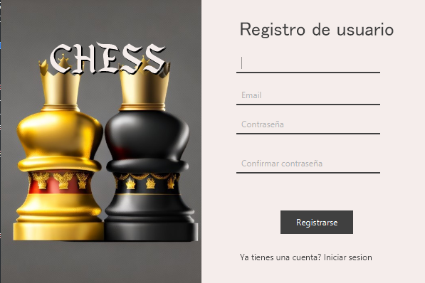

# Chess Game Application

Este es un juego de ajedrez basado en Java que utiliza JavaFX para la interfaz gráfica y PostgreSQL para el almacenamiento de datos.

## Requisitos

- **Java 17+** (o la versión recomendada según tu proyecto).
- **JavaFX SDK 22.0.1** (o la versión correspondiente).
- **PostgreSQL JDBC Driver** (versión 42.7.3 o compatible).

## Estructura del Proyecto

- **CHESS.jar**: El archivo JAR ejecutable de la aplicación.
- **lib/**: Carpeta que contiene las bibliotecas necesarias para el proyecto:
  - **javafx-sdk-22.0.1/**: Contiene los archivos JAR de JavaFX.
  - **postgresql-42.7.3.jar**: El controlador JDBC de PostgreSQL.
- **launch/**: Carpeta con los scripts de ejecución:
  - **run.bat**: Script para ejecutar la aplicación en Windows.
  - **run.sh**: Script para ejecutar la aplicación en Linux. **chmod +x**

## Configuración

### 1. Descargar e Instalar Java

Asegúrate de tener Java 17 o superior instalado en tu sistema. Puedes verificar tu versión de Java ejecutando el siguiente comando:

```bash
java -version





